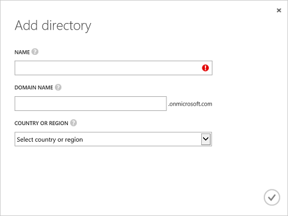

# Create an Azure Active Directory tenant
---  
Using the Data Catalog REST API, you can create a Data Catalog app in any platform that supports calling REST operations. However, before you get started creating a Data Catalog app, you need an **Azure Active Directory** tenant, and an organizational user.  
  
### In this article  
- [Create an Azure Active Directory tenant](#setup)  
- [Add a user to your Azure Active Directory tenant](#newuser)  
  
## Create an Azure Active Directory tenant for a Data Catalog app  
  
Data Catalog apps are integrated with **Azure Active Directory** (Azure AD) to provide secure sign in and authorization for your app. To integrate a Data Catalog app with Azure AD, you register the details about your application with Azure AD by using the Azure Management Portal. Before you can register an app, you need to create an Azure AD tenant.  
  
  
### Create an Azure Active Directory tenant  
To create a Data Catalog app, you need an Azure Active Directory (Azure AD) tenant.   
  
**Note** If you have an Office 365 account, you already have an Azure AD .  
  
Here's how to setup **Azure Active Directory**:  
  
 1. Navigate to https://manage.windowsazure.com and log in with the account that has an Azure subscription.  
 2. Click **ACTIVE DIRECTORY** management icon in the left pane.  
 3. Click **NEW** button at the bottom of the page.  
 4. Choose **APP SERVICES** > **ACTIVE DIRECTORY** > **DIRECTORY** > **CUSTOM CREATE**.  
  
      
      
 5. In the **Add directory** page, enter a name and domain name. For country or region choose United States or the country were Data Catalog is available.   
  
      
  
 6. Choose OK icon. An Azure Active Directory is created.  
  
  
### Add a user to your Azure Active Directory tenant  
You need a user from your Azure AD to register an Azure AD app. Here's how to add a user to your Azure Active Directory tenant:  
  
 1. In your **Azure Active Directory**, click **USERS**.  
  
      
  
 2. At the bottom of the page, click **ADD USER**. A user account is used to register a Data Catalog app.   
   
 3. In the **Tell us about this user page**:  
    
    1. For **TYPE OF USER**, choose **New user in you organization**.  
    2. Enter your **USER NAME**.  
    3. Click **Next**.  
      
       
  
 4. In the **user profile** page, enter your **DISPLAY NAME**. Display name is a required field.  
  
      
  
 5. Click **Next**. For **ROLE**, you can use **User**.   
 6. Click **Create** to create a temporary password. The new user is assigned a temporary password that must be changed on first sign in.  
 7. In the **Get temporary password** page, copy the temporary password, and click **Complete** icon. You use the temporary password when you first login to your AAD.  
 8. After you click the **Complete** icon, a new Azure AD user is created.  
      
To complete the next step the new AAD user will need access to an Azure Subscription.  You can either make the new user a co-admin on the existing subscription or you can create a new subscription for the new AAD user.  
  
Once you have an **Azure Active Directory** tenant you can [Register your app](Register-a-client-app.md).   
  
## See Also  
- [What is an Azure AD directory?](https://msdn.microsoft.com/en-us/library/azure/jj573650.aspx)  
- [How to get an Azure Active Directory tenant](https://azure.microsoft.com/en-us/documentation/articles/active-directory-howto-tenant/)  
