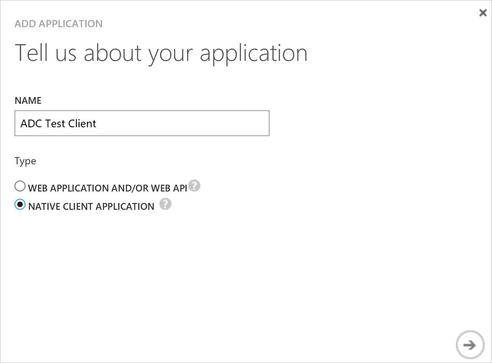

# Register a client app
---  
This article shows you how to register a Data Catalog client app in Azure Active Directory (Azure AD). To allow your application access to the Data Catalog REST API, you need to register your application with **Azure Active Directory**. This will allow you to establish an identity for your application and specify permissions to Data Catalog REST resources.  
  
**Important** Before you register a Data Catalog app you need an [Azure Active Directory tenant and an organizational user](Create-an-Azure-Active-Directory-tenant.md).   
  
### In this article  
  
- [Register a client app](#client)  
- [How to get a client id ](#clientID)  
  
  
## Register a client app  
You need to register your client app in **Azure Active Directory** to establish an identity for your application and specify permissions to **Data Catalog** REST resources. When you register a client app, such as a console app, you receive a **Client ID**.  The **Client ID** is used by the application to identify themselves to the users that they are requesting permissions from.  
  
To learn how to authenticate a client app using an Azure AD **Client ID**, see [Authenticate a client app](Authenticate-a-client-app.md).  
  
### Register a client app  
  
Here's how to register a client app:  
1. Review the [Microsoft Azure Service Agreement & Terms](https://azure.microsoft.com/en-us/support/legal).  
2. Sign into your Microsoft Azure subscription at https://manage.windowsazure.com using your AAD user name.  
3. In the left service panel, choose **ACTIVE DIRECTORY**.  
4. Click the active directory that you belong to.  
  
      
  
5. Click **APPLICATIONS**.  
  
      
  
6. Click **ADD**.  
  
      
  
7. In the **What do you want to do** page, click Add an application my organization is developing. For some Active Directory configurations, you might not see this page.  
   
       
     
8. In **Tell us about your application**, enter a **NAME**, and choose **NATIVE CLIENT APPLICATION** for the type, and click **Next** icon..  
  
      
   
9. In **Application information**, enter a **REDIRECT URI**. For a client app, a redirect uri gives AAD more details on the specific application that it will authenticate. For a client app, you can use this Uri: https://login.live.com/oauth20_desktop.srf.  
  
10. Click the **Complete** icon.  
11. In the application page, choose **CONFIGURE**. You will see your **CLIENT ID**.   
12. In the **CONFIGURATION** page, under **permissions to other applications**, click **Add Application**.  
  
      
  
13. In **Permissions to other applications**, choose **Microsoft Azure Data Catalog**.  
  
      
      
14. Click **Complete** icon.  
15. In the **permissions to other applications** group, choose all **Delegated Permissions**, and chooses one or more permissions.  
  
      
      
16. Click **Save**.  
  
  
## How to get a client app id  
When you register a client app, such as a console app, you receive a **Client ID**.  The **Client ID** is used by the application to identify themselves to the users that they are requesting permissions from.  
  
Here's how to get a client id:  
  
1. Sign into your Microsoft Azure subscription at https://manage.windowsazure.com.  
2. In the left service panel, choose **ACTIVE DIRECTORY**.  
3. Click the active directory that you belong to..  
4. Click **APPLICATIONS**.  
5. Choose an application.  
6. In the application page, choose **CONFIGURE**.  
7. In the **CONFIGURE** page, copy the **CLIENT ID**.  
  
      
  
  
